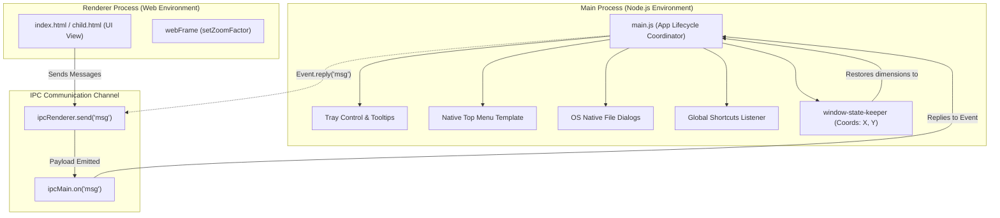

# Learning Electron.js Sandbox

A comprehensive hands-on learning playground and educational sandbox demonstrating the core native capabilities of **Electron.js**. Built with vanilla JavaScript, HTML5, and Node.js APIs, this repository serves as a step-by-step masterclass covering desktop window states, inter-process communication (IPC), native dialogs, global key shortcuts, system tray setups, and custom context menus.

---

## 🛠️ Technology Stack & Tooling


---

## 🚀 Key Electron.js Concepts Covered

*   **🔄 Inter-Process Communication (IPC)**: Establishes bidirectional message channels (`ipcMain` and `ipcRenderer`) allowing data synchronization between the Main Process and Renderer UI thread.
*   **💾 Window State Preservation**: Integrates `electron-window-state` to dynamically record and restore application viewport dimensions (`width`, `height`) and coordinates (`x`, `y`) across user sessions.
*   **💻 Native Application Menus**: Replaces default OS header menus with a custom template featuring cascading File, Edit, and Help submenus tailored to macOS/Windows platforms.
*   **⌨️ Global Keyboard Shortcuts**: Implements application-level hotkeys (`shift+o`) and system-wide global triggers (`CommandOrControl+X+Z`) to execute native file dialogs and window reloads.
*   **📂 Native Operating System Dialogs**: Connects to the local file system using `dialog.showOpenDialog` to select files from native directories (e.g., standard OS Videos folders).
*   **📥 Native System Tray Integration**: Boots a native background instance using `Tray` configurations, complete with tooltip hover properties, context control menus, and show/hide toggle behaviors.
*   **🔍 Viewport Zooming Control**: Configures renderer-side web frame elements (`webFrame`) to dynamically zoom the browser layout interface in or out.
*   **🖱️ Custom Context Popups**: Binds right-click events (`win.webContents.on('context-menu')`) to trigger context menu flyouts exactly at the cursor coordinates.

---

## 📐 Main vs Renderer Process Architecture

This sandbox illustrates the boundary between Node.js execution (Main Process) and front-end rendering (Renderer Process):



---

## 📂 Repository File Directory

```
Learning-Electron-Js-from-Youtube/
├── eleApp.png                     # Application logo asset used for Native Tray icon
├── index.html                     # Primary Renderer UI viewport showcasing zooming & IPC buttons
├── child.html                     # Secondary educational window frame template
├── main.js                        # Primary Electron Coordinator managing window, shortcuts & OS hooks
├── .gitIgnore                     # Rules declaring build/dependency exclusions
└── package.json                   # Project configuration declaring dependency items and commands
```

---

## 📝 Key Source Code Showcases

### 1. Persistent Window Dimensions ([main.js](file:///d:/for%20CV/My%20learnings/Learning-Electron-Js-from-Youtube/main.js))
Loads cached dimensions on ready, and binds the keeper manager to keep window positions synced:
```javascript
const windowStateKeeper = require("electron-window-state");

function createWindow() {
  const mainWindowState = windowStateKeeper({
    defaultWidth: 900,
    defaultHeight: 600,
  });

  win = new BrowserWindow({
    x: mainWindowState.x,
    y: mainWindowState.y,
    width: mainWindowState.width,
    height: mainWindowState.height,
    backgroundColor: "#e8e7e6",
    webPreferences: {
      nodeIntegration: true,
      contextIsolation: false,
    },
  });

  win.loadFile("index.html");
  mainWindowState.manage(win); // Tracks and saves window bounds automatically
}
```

### 2. Bidirectional IPC Channel Communication
Exchanges message buffers between process threads seamlessly:
```javascript
// Main Process (main.js)
const { ipcMain } = require("electron");

ipcMain.on("msg", (event, arg) => {
  console.log("Received: " + arg); 
  event.reply("msg", "Thank You from the main process!");
});

// Renderer UI Thread (index.html)
const { ipcRenderer } = require("electron");

function sendMsg() {
  ipcRenderer.send("msg", "Hello from the renderer process!");
  ipcRenderer.on("msg", (event, arg) => {
    console.log("Reply: " + arg);
  });
}
```

### 3. Dynamic Scaling and Zooming ([index.html](file:///d:/for%20CV/My%20learnings/Learning-Electron-Js-from-Youtube/index.html))
Directly updates application display scaling factors via the Electron web frame wrapper:
```javascript
const { webFrame } = require("electron");

function zoomIn() {
  webFrame.setZoomFactor(webFrame.getZoomFactor() + 0.1);
}

function zoomOut() {
  webFrame.setZoomFactor(webFrame.getZoomFactor() - 0.1);
}
```

### 4. System Tray Configurations
Launches desktop-tray actions linked to application state triggers:
```javascript
const { Tray, Menu } = require("electron");

tray = new Tray("eleApp.png");
tray.setToolTip("This is my electron learning application.");
tray.on("click", () => {
  win.isVisible() ? win.hide() : win.show();
});

let template = [
  {
    label: "Show App",
    click: () => { win.isVisible() ? win.hide() : win.show(); }
  },
  {
    label: "Exit",
    click: () => { app.quit(); }
  }
];
tray.setContextMenu(Menu.buildFromTemplate(template));
```

---

## 🚀 Setup & Execution Guide

### Prerequisites
Make sure the following are installed:
*   **Node.js** version 18.0 or higher
*   **npm** (Node package manager)

### Installation & Run Steps
1.  **Clone the Repository**:
    ```bash
    git clone https://github.com/Imtiaz-Ali17314/Learning-Electron-Js-from-Youtube
    cd Learning-Electron-Js-from-Youtube
    ```
2.  **Install Node Dependencies**:
    ```bash
    npm install
    ```
3.  **Start Application (Standard Mode)**:
    ```bash
    npm start
    ```
4.  **Start Application (Developer Watch Mode)**:
    Fires up the Electron runtime using Nodemon to automatically restart whenever main process files change:
    ```bash
    npm run watch
    ```

### Packaging & Executable Distribution
To pack applications into single-file binary files using `electron-builder`:
```bash
npm run build
```
Production assets will build into the newly created `dist/` directory.
